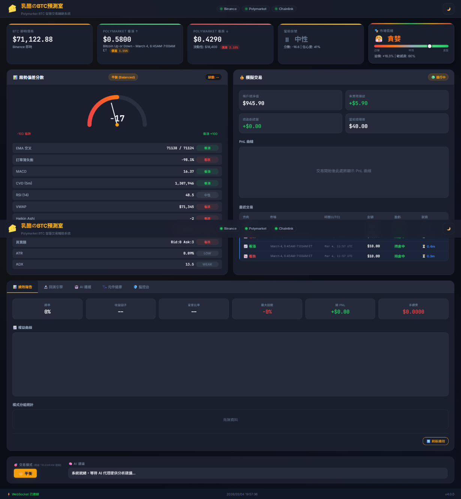

# 🧀 CheeseDog — Polymarket Quantitative Trading Terminal

> An event-driven, institutional-grade quantitative trading system for [Polymarket](https://polymarket.com/)'s BTC 15-minute Up/Down binary options markets.

---

## Architecture Overview



CheeseDog is a **full-stack quant trading terminal** that fuses multi-source real-time data with both **directional prediction (Taker)** and **market-making (Maker/Liquidity Provision)** strategies.

### Hybrid Quant-AI Architecture (The Hybrid Moat)

CheeseDog employs a proprietary dual-layer engine designed to survive and thrive during extreme market volatility:
1. **Macro Sentiment Radar (The Brain):** An autonomous AI Agent continuously scans unstructured data (e.g., global news, crypto Twitter) to detect impending macroeconomic shifts (like CPI releases).
2. **Bayesian Risk Engine (The Body):** Traditional indicators often fail during black-swan events. Instead of letting AI blindly authorize trades, our AI passes a `macro_regime` state to the backend. The core system then utilizes a **2D Bayesian Learning Matrix** to dynamically discount confidence scores and widen spread execution based on historical hit rates during similar volatile periods. 

*Result:* The system provides consistent liquidity during normal conditions but instantly transitions into a defensive, highly selective institutional market-making stance during real-world crises.

### Core Design Principles

| Principle | Implementation |
|-----------|---------------|
| **Event-Driven Architecture** | Custom `MessageBus` (Pub/Sub) inspired by [NautilusTrader](https://github.com/nautechsystems/nautilus_trader). All data feeds publish events; strategy engine subscribes and computes signals at millisecond-level reactivity. |
| **Dependency Inversion** | `TradingEngine` abstract interface allows seamless swap between Simulation and Live engines with zero strategy code changes. |
| **Component State Machines** | All feeds follow `INITIALIZING → READY → RUNNING → DEGRADED → FAULTED` lifecycle for production-grade health monitoring. |
| **Fail-Fast Configuration** | `ConfigValidator` checks all required env vars at startup with mode-aware validation (Simulation / Live / Telegram), providing actionable fix suggestions before any trading logic executes. |
| **Simulation Fidelity** | Fill model hardened with real CLOB queue-position simulation — prevents the "God Mode" overfitting trap where cheap OTM contracts appear easily fillable in backtest. |

---

## Tech Stack

### Backend (Python 3.11)
- **Framework**: FastAPI + Uvicorn (async)
- **Event System**: Custom MessageBus (asyncio Queue, 50K event capacity)
- **Trading SDK**: `py-clob-client` & `@polymarket/builder-signing-sdk` (Order Attribution compliant)
- **Data Sources**: Binance WebSocket, Polymarket CLOB REST/WS (L2, 99 levels), Chainlink Oracle (Polygon RPC)
- **Database**: SQLite (trade history, maker order tracking, performance metrics)
- **Backtesting**: Pandas + PyArrow (Parquet streaming, Wind Tunnel engine with Grid Search)
- **Notifications**: `python-telegram-bot` v20+ (HITL remote control)

### Frontend
- React 18 / Vite (Component-based Architecture)
- Real-time dashboard with 18+ live indicators and WebSocket push updates
- Phase 2 Tabs: Performance Report, Wind Tunnel Backtest Engine, AI Advice (HITL), Health Status
- Live Maker Panel with Rate Guard token bucket visualization

### Testing
- **122 unit tests** (pytest) covering fees, risk management, signal generation, simulation
- All passing in < 0.35s | 4 test modules with dedicated coverage per subsystem

---

## Data Pipeline

```
┌──────────────────┐     ┌───────────────────┐     ┌───────────────────┐
│  Binance         │     │  Polymarket       │     │  Chainlink        │
│  WebSocket       │     │  CLOB API         │     │  Oracle           │
│  ─────────────── │     │  ───────────────  │     │  ───────────────  │
│  • BTC Trades    │     │  • L2 Orderbook   │     │  • BTC/USD Price  │
│  • 1m Klines     │     │  • Contract Prices│     │  • On-chain feed  │
│  • Order Book    │     │  • Spreads        │     │  • Polygon RPC    │
│  (20 levels)     │     │  (99 levels)      │     │  (persistent TCP) │
└────────┬─────────┘     └────────┬──────────┘     └────────┬──────────┘
         │                        │                         │
         └────────────────────────┼─────────────────────────┘
                                  │
                    ┌─────────────▼───────────────┐
                    │       MessageBus            │
                    │   (Pub/Sub Event System)    │
                    │   50,000 event queue        │
                    └─────────────┬───────────────┘
                                  │
              ┌───────────────────┼────────────────────┐
              │                   │                    │
    ┌─────────▼───────┐  ┌────────▼───────┐  ┌────────▼──────┐
    │  Signal Engine  │  │  Risk Manager  │  │  Smart Router │
    │  ────────────── │  │  ────────────  │  │  ──────────── │
    │  12+ indicators │  │  4 circuit     │  │  Taker (FOK)  │
    │  Bayesian cal.  │  │  breakers      │  │  Maker (GTC)  │
    │  Sentiment      │  │  Kelly sizing  │  │  EV Filter    │
    └─────────────────┘  └────────────────┘  └───────────────┘
```

---

## Signal Engine

The composite signal generator fuses **12+ technical indicators** into a single normalized bias score:

| Category | Indicators |
|----------|------------| 
| **Trend** | EMA Crossover (5/20), Heikin-Ashi Candle Patterns, MACD Histogram |
| **Momentum** | RSI (14), Bollinger Bands %B |
| **Volume** | CVD (1m/3m/5m), Volume Profile POC |
| **Order Flow** | OBI (Order Book Imbalance), Buy/Sell Walls |
| **Volatility** | ATR (Average True Range), ADX (Average Directional Index) |
| **External** | External AI Agent (e.g., OpenClaw) Intervention via Host-Parasite Model |

### Agent-Centric "Host-Parasite" Model
There is no baked-in AI model (e.g., OpenAI SDK) tying the system down. Instead, CheeseDog provides `/api/llm/` endpoints that expose dense, structural environment data. Any external AI Agent with API-calling capabilities can read the state, perform off-chain sentiment analysis (e.g., parsing Twitter/X for breaking news), and inject strategy proposals back into the system.

### Market Regime Detection
- **ADX-based** automatic regime classification: `strong_trend`, `mild_trend`, `ranging`, `choppy`
- Trading mode auto-switches based on detected regime (60-second cooldown for 15m contracts)
- Maker strategy auto-pauses during strong trends (adverse selection protection)

### Bayesian Self-Calibration
- Dynamically segments signals by price bucket and tracks realized win rates
- Calibrates AI confidence against historical outcomes — punishes overconfidence, rewards accuracy
- `BayesianUpdater` integrates directly into the EV filter and position sizing

---

## Risk Management

Multi-layer defense system designed with **institutional-grade** paranoia:

- **Circuit Breaker 1**: Daily loss limit → auto-halt
- **Circuit Breaker 2**: Consecutive loss limit → cooldown period
- **Circuit Breaker 3**: Max drawdown → emergency stop
- **Circuit Breaker 4**: Daily trade cap → prevent overtrading
- **Kelly Criterion** position sizing (1/5 Kelly fraction, conservative)
- **Capital Management Modes**: Compounding / House Money / Watermark (step-up floor protection)
- **Double Verification**: Virtual ledger + live Polymarket API balance cross-check before each live trade
- **HITL Supervision**: Telegram Bot for remote approval of high-risk proposals via inline buttons

---

## Simulation Fidelity

> *"If your backtest shows 4600% PnL in 32 hours, stop and question your fill model — not your strategy."*

CheeseDog learned this lesson firsthand. Our fill model was hardened with three key improvements:

| Problem | Fix |
|---------|-----|
| OTM contracts with `price < 0.05` filling instantly | `MM_QUOTE_FLOOR = 0.05` — hard floor on quoting extreme-price contracts |
| Ignoring queue position (we were last in line, system thought we'd fill) | CLOB depth validation: `ahead_depth > MM_FILL_DEPTH_RATIO × my_size` → no fill |
| Fill decision disconnected from real L2 order book | `check_pending_fills` now reads live `clob_feed.up_book / down_book` before deciding |

This prevents the most dangerous backtest-to-live performance gap in prediction market making.

---

## Polymarket Fee Model

Implements Polymarket's **exact quadratic fee formula** for 15-minute crypto markets:

| Side | Fee Range | Deducted From  |
|------|-----------|----------------|
| Buy  | 0.2% – 1.6% | Token amount |
| Sell | 0.8% – 3.7% | USDC proceeds|

Fee rate scales with contract price deviation from 0.50 (most liquid point). Critical edge case: settlement at $1.00 means the sell-side fee calculation must use `contract_price=1.0`, not the entry price — which changes the fee by up to 3×. See [`examples/fee_model.py`](examples/fee_model.py).

---

## Polymarket Builder Compliance

CheeseDog architecture strictly adheres to the official **Builder Program** requirements:
- **Order Attribution:** Integrated `@polymarket/builder-signing-sdk` via `ClobClient` initialization parameters. All proprietary trades automatically transmit the `POLY_BUILDER_API_KEY`, `POLY_BUILDER_SIGNATURE`, `POLY_BUILDER_TIMESTAMP`, and `POLY_BUILDER_PASSPHRASE` headers for volume tracking.
- **Account Tiers Awareness:** Dynamically adjusts Token Bucket parameters in the API Rate Limiter based on whether the account is Verified (3000 tx/day) or Unverified (100 tx/day).
- **Zero End-User Exposure:** This is a proprietary algorithmic infrastructure (Own Funds only). It contains no end-user facing connection (like wallet connect interfaces) and is designed solely for isolated, independent strategy execution.

---

## Market Making (Maker Strategy)

- **Dynamic Spread Engine**: AI-predicted mid-price ± configurable spread
- **ADX-gated activation**: Only quotes during low-trend (ranging) regimes
- **Inventory Skew Management**: Auto-adjusts bid/ask to rebalance inventory
- **Cancel & Replace Loop**: Periodic re-quoting with deadband filter (skip if price hasn't moved enough)
- **Rate Limiting Architecture**: Token Bucket + Deadband to stay within API quotas
- **Queue Position Model**: Simulates real CLOB fill probability based on depth ahead of our order

---

## API Rate Limit Design

```
┌──────────────────────────────────────────────────────┐
│                  Rate Guard Pipeline                 │
│                                                      │
│   Market Move?                Token Available?       │
│   ┌───────────┐     YES     ┌──────────────┐         │
│   │ Deadband  │───────────▸│ Token Bucket  │──▸ API  │
│   │ Filter    │            │ Rate Limiter  │         │
│   │ Δ < 2%?   │     NO     │ N tx/min      │         │
│   │ → SKIP    │──── ✗      │ burst: 10    │          │
│   └───────────┘             └──────────────┘         │
│                                                      │
│   Layer 1: Skip if market     Layer 2: Hard rate     │
│   hasn't moved enough         cap enforcement        │
└──────────────────────────────────────────────────────┘
```

---

## HITL Supervision (Human-in-the-Loop)

The `supervisor` module routes proposals from the External AI Agent through a permission gatekeeper before any execution:

```
External Agent Signal
        │
        ▼
┌───────────────────┐
│  AuthorizationGate│  → Mode: AUTO / HITL / MONITOR
└────────┬──────────┘
         │
    ┌────┴────┐
    ▼         ▼
  AUTO       HITL
 execute   → ProposalQueue → Telegram Bot
            (state machine)   ↓
                           /approve or /reject
                           within TTL window
```

The Dashboard includes a read-only Supervisor panel displaying proposal history, approval stats, and Telegram connection status.

---

## Wind Tunnel Backtester

Grid Search engine to stress-test strategy parameters against historical Parquet data:

- **Physical Settlement**: Uses real Binance K-line close prices for 15m outcomes — no "God Mode" oracle
- **Hacker Mode (Monkey Patching)**: Replays historical CLOB depth into the signal engine with zero code changes
- **Grid Search**: Exhaustively tests `MM_OFFSET` parameters to find optimal Maker spread settings
- **Bayesian Integration**: BayesianUpdater accumulates win/loss from backtest runs to carry prior confidence into paper trading

---

## Example Code

See the [`examples/`](examples/) directory for safe-to-share architectural components:

- [`trading_engine_interface.py`](examples/trading_engine_interface.py) — Abstract TradingEngine (Dependency Inversion)
- [`fee_model.py`](examples/fee_model.py) — Polymarket quadratic fee model
- [`event_bus.py`](examples/event_bus.py) — Lightweight async Pub/Sub MessageBus
- [`rate_limiter.py`](examples/rate_limiter.py) — Token Bucket rate limiter for API protection

---

## Dashboard


Real-time monitoring dashboard featuring:
- 18+ live market indicators with WebSocket push updates
- PnL curve & equity history with simulation/live mode indicator
- Supervisor / HITL control panel (proposal history, approval stats, Telegram status)
- Component health monitor (State Machine: RUNNING / DEGRADED / FAULTED per feed)
- Telegram HITL inline-button approval interface

---

## Testing Summary

| Module | Tests | Coverage Focus |
|--------|-------|---------------|
| `test_fees.py` | 27 | Quadratic fee curves, round-trip costs, edge cases (settlement at $1.00) |
| `test_risk_manager.py` | 20 | Circuit breakers, Kelly sizing, capital modes, BayesianUpdater routing |
| `test_signal_generator.py` | 37 | Bias scores, regime detection, sentiment factor, strike price parsing |
| `test_simulator.py` | 38 | Trade execution, settlement, maker quotes, TTL, Bayesian end-to-end |
| **Total** | **122** | **All passing in < 0.35s** |

---

## Roadmap

| Phase | Status | Focus |
|-------|--------|-------|
| Phase 1–4 | ✅ Complete | Data pipeline, simulation, live trading, HITL supervision |
| Phase 5 | 🟡 In Progress | Maker strategy: dynamic spread, inventory management, cancel-replace loop |
| Phase 2.5 | 📋 Research | **Quant Desk Simulation Upgrade**: Agent-Based Simulation (Zero-Intelligence Agents), Brier Score calibration metric, Sequential Monte Carlo (Particle Filter) |
| Phase 6 | ✅ Complete | Frontend modularization (React 18 / Vite component architecture) |
| Phase 7 | ✅ Complete | Testing framework (122 unit tests), Config Validator (fail-fast) |
| Phase 8 | ✅ Complete | Simulation fidelity: Fill Model Hardening, CLOB queue-position simulation |
| Future | 📋 Planned | Sub-100ms HFT event loop, multi-exchange adapter (Predict.fun) |

> Phase 2.5 is planned after Phase 5 Maker strategy validation. See [`docs/SystemDesign.md`](docs/SystemDesign.md) for the full research design.

---

## License

This showcase repository contains selected architectural components for demonstration purposes.
The full trading system is maintained in a private repository.

© 2026 CheeseDog (PolyCheese Quant)

